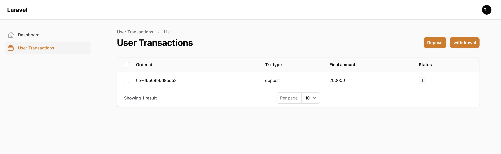

# Simple Payment Gateway

## Setup
 - composer install
 - cp .env.example .env
 - php artisan key:generate
 - php artisan migrate --seed
 - php artisan serve
 - php artisan queue:work

## Demo Account

http://[host]:[port]/user
- email: test@example.com
- password: admin123

## API Deposit

```curl
curl --location 'localhost:8000/api/deposit' \
--header 'Accept: application/json' \
--header 'Content-Type: application/json' \
--header 'Authorization: ••••••' \
--data '{
"order_id": "trx-66b08b6d8ed58",
"amount": "200000.00",
"timestamp": "03/08/2024"
}'
```

## Screenshots





